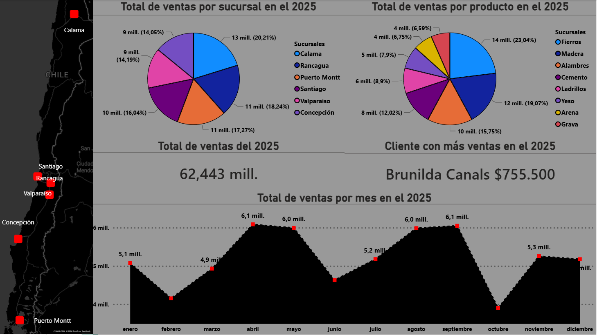

# 🏗️ Construction Sales Analytics – End-to-End Data Project


## 📌 Overview

## 📸 Dashboard Preview


## 📊 Key Metrics (2025)
- 💰 Total Revenue: $62,442,500
- 🧾 Total Transactions: 1,000
- 🎟️ Average Ticket: $62,442
- 👥 Unique Customers: 289
- 📦 Products Sold: 8

This project simulates and analyzes sales data for a construction materials company operating across multiple branches in Chile during 2025.

It demonstrates a full data analytics pipeline, from data generation to business insights, using:

Python (data generation + automated reporting)
Excel (data cleaning + transformation)
Power Query (ETL)
Power BI (dashboarding)
DAX (business logic)


## 🎯 Objective

The goal of this project is to showcase key data analysis skills by solving a realistic business scenario:

How can a company understand its sales performance, top customers, product demand, and branch contribution using data?


## 🧠 Skills Demonstrated

Data generation & simulation
Data cleaning (handling errors & inconsistencies)
Data modeling (joins, transformations)
Exploratory Data Analysis (EDA)
KPI definition
Data visualization
Dashboard design
DAX for business metrics
Automated reporting (Python → PDF)


## 🔄 Data Pipeline

1. Data Generation (Python)
2. Data Cleaning (Excel + Power Query)
3. Data Modeling (Merged dataset)
4. Analysis (Excel + Power BI)
5. Visualization (Dashboard)
6. Reporting (Automated PDF)


## 📂 Project Structure

```
Proyecto_1/
│
├── Generador_aleatorio_datos.py   # Data simulation script
├── FormatoTablaProducto.bas       # Excel macro (formatting)
├── Libro_consolidado.xlsx         # Cleaned & transformed dataset
├── Informe_P1.py                  # Automated report generator (PDF)
├── Informe_P1.pdf                 # Final report output
├── DashboardP1.pbix               # Power BI dashboard
├── products.xlsx                  # Raw products data
├── sales.xlsx                     # Raw sales data
└── README.md
```


## ⚙️ Project Workflow

### 1️⃣ Data Generation (Python)

A custom script generates synthetic sales data:

+1000 transactions
Multiple branches (Santiago, Valparaíso, Concepción, etc.)
Product catalog (construction materials)
Intentional data errors (to simulate real-world scenarios)

Outputs:

sales.xlsx
products.xlsx

### 2️⃣ Excel Automation (VBA Macro)

A macro (FormatoTablaProducto.bas) was used to:

Standardize formatting
Improve readability
Prepare product data for analysis

### 3️⃣ Data Cleaning & Transformation (Power Query)

Using Excel + Power Query:

Removed inconsistencies
Fixed data types
Merged datasets (sales + products)
Created a clean model → Libro_consolidado.xlsx

### 4️⃣ Exploratory Analysis (Excel)

Three main analytical sheets were created:

#### 📊 VentasTotales
Total sales by branch
% contribution per branch
#### 📈 VentasTiempo
Monthly sales evolution (2025)
#### ⭐ ClienteEstrella
Top customer of the year
Identified using formulas like:
XLOOKUP
FILTER

### 5️⃣ Dashboard (Power BI)

An interactive dashboard was built using Libro_consolidado.xlsx.

#### Key Components:
🗺️ Map → Branch locations
🥧 Pie charts:
Sales by branch
Sales by product
💰 KPI Cards:
Total sales
Top customer (via DAX)
📈 Monthly sales trend

#### 🧮 Example DAX (Top Customer):
```
Top Cliente Texto =
VAR TopTable =
    TOPN(
        1,
        SUMMARIZE(
            sales,
            sales[customer_name],
            "Total", CALCULATE(SUM(sales[total_sale]), YEAR(sales[sale_date]) = 2025)
        ),
        [Total], DESC
    )
VAR Nombre = MAXX(TopTable, sales[customer_name])
VAR Total = MAXX(TopTable, [Total])
RETURN
    Nombre & " - $" & FORMAT(Total, "#,##0")
```

### 6️⃣ Automated Report (Python → PDF)

A Python script (Informe_P1.py) generates a professional PDF report.

#### 📄 Report Structure:
**1. Cover Page**
Title
Date
**2. General Summary**
Total sales
Number of sales
Average ticket
Unique customers
Unique products
📈 Monthly sales chart
🧾 Top 10 customers table
📦 Sales by product table
**3. Branch Analysis (per branch)**
Total sales
Number of transactions
Average ticket
Top customer (name + value)
📈 Monthly sales evolution
**4. Distribution Analysis**
🥧 Sales % by:
Branch
Product
Month


## 📊 Key Insights (Example)

- The top 3 products (Fierros, Madera, Alambres) account for over 50% of total revenue
- Sales peak between April and September, indicating seasonal demand patterns
- Revenue distribution across branches is relatively balanced, with no single branch exceeding 21%
- A small group of customers contributes disproportionately to total sales (top 10 customers)


## #⚙️REQUIREMENTS

pandas
matplotlib
openpyxl
reportlab


## 🚀 How to Run

### 1. Clone the repository**
git clone https://github.com/KlausScherer/sales_analytics_report.git

### 2. Install dependencies**
pip install pandas matplotlib openpyxl

### 3. Run the report generator**
python Informe_P1.py


## 💡 Why This Project Matters

This project reflects a real-world analytics workflow:

✔ Raw data → messy
✔ Cleaning & transformation
✔ Business questions
✔ Visualization & storytelling
✔ Automated reporting

It demonstrates the ability to:

Think like a data analyst
Translate data into insights
Communicate results effectively


## 🔮 Future Improvements

Add SQL database integration
Deploy dashboard to Power BI Service
Add forecasting (time series models)
Include customer segmentation (RFM analysis)


## 👤 Author

Klaus Walter Scherer Iglesias


## ⭐ Final Note

This is not just a data project — it's a complete analytical pipeline, designed to reflect how data is actually used in business environments.
